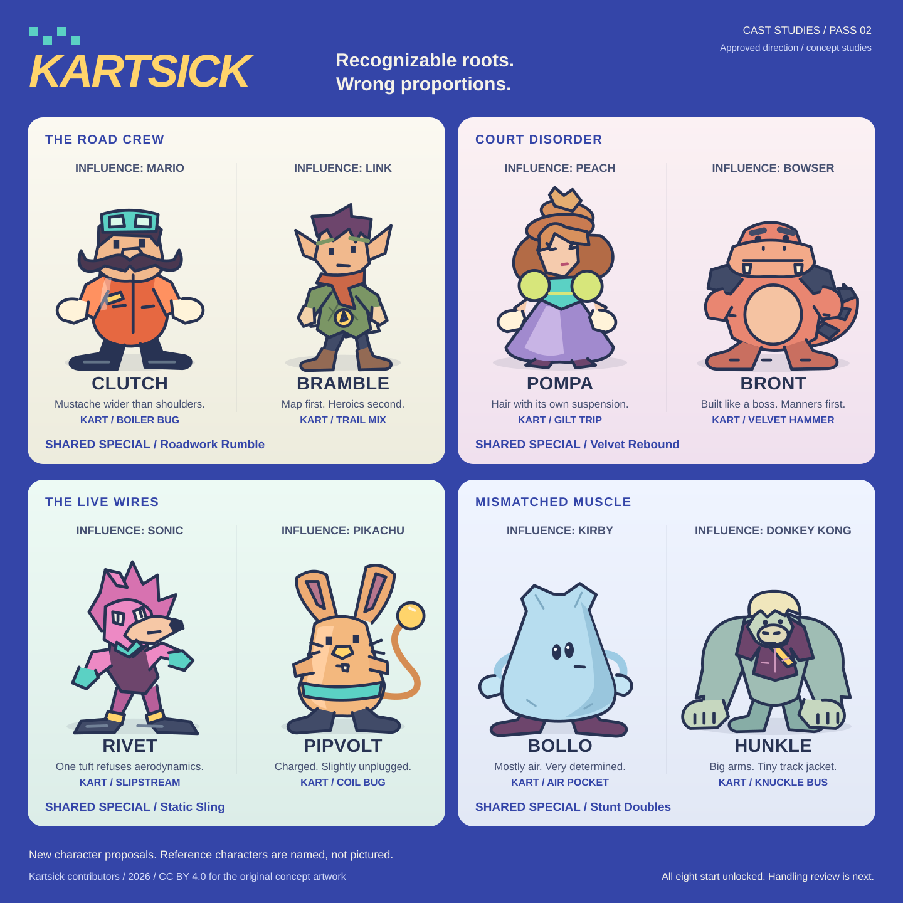

# Kartsick: welcome to Belltumble

**Creative direction 02 - approved for implementation.**

This proposes the eight-character roster, their eight kart bodies, four shared
signature specials, six course identities, and original art/audio direction.
The second direction was approved after review. The drawings remain concept
studies, not a claim that every production asset is finished or legally cleared.
The approved release scope remains unchanged, and the first-driving-slice
handling checkpoint is still required before six-track expansion.

## The direction

**Recognizable console-mascot roles, as remembered slightly incorrectly.**

The first roster was too detached from recognizable console characters. This
pass names eight specific influence anchors and makes the visual hook concrete:
a stout mustached tradesman, an elfin adventurer, an elaborate princess, a huge
reptilian rival, a cocky quilled speedster, a small electric animal, a soft
impossible creature, and a powerful ape.

The goal is not to hide the inspiration behind vague "era" language. It is also
not to trace an existing character and change its name or palette. Each design
needs a different combination of anatomy, face, costume, proportions, movement,
and accessories. Reference names below identify the intended design conversation;
no reference images, logos, models, voices, or game assets are included.

Belltumble is a valley of farms, shopping promenades, treetop neighborhoods, and
improbably well-maintained attractions. Its residents take a very silly racing
league completely seriously. The skyway and mountain road belong to the same
place, not six unrelated game worlds.

The visual joke is in proportions and performance: Clutch's mustache is wider
than his shoulders; Pompa's hair is too architecturally ambitious for her neck;
Rivet's swept-back crest contains one tuft that insists on facing forward.
They are appealing at speed and increasingly peculiar up close. No gore, slime,
horror teeth, body-horror seams, or grungy parody textures.

Think enamel toys, plush fabric, translucent colored plastic, painted wood, and
rubber soles, brought together by warm lighting. Silhouettes stay smoothly
modeled; these drawings are proportion studies, not an instruction to ship flat
cutouts or stacks of primitives.

**Signature visual:** oversized tandem karts with a little rear standing deck,
so both personalities are always visible. Steering, leaning, passing an item,
and swapping become miniature physical comedy. The actual mechanics follow the
approved reference, not new comedy-driven control rules.

## Eight explicit influence anchors

| Proposed character | Recognizable reference and visual hook | New design and off-model twist | Associated kart body |
|---|---|---|---|
| **Clutch** | **Mario:** compact, mustached, hands-on comic hero with outsized hands and confident body language. | A boiler-house mechanic with a broad trapezoid head, absurd horizontal handlebar mustache, tall mint welding goggles, short orange zip-front coverall, pale mittens, and heavy navy rail boots. No lettered cap, red-shirt/blue-overall combination, or copied face. The mustache keeps vibrating after he stops talking. | **Boiler Bug:** orange tub-bodied runabout with a ribbed nose and twin short exhausts; strong acceleration/recovery, less straight-line speed. |
| **Bramble** | **Link:** young point-eared woodland adventurer, practical tunic, boots, and earnest hero posture. | A plum-haired mapmaker with long leaf-shaped ears, a moss quilted tunic, enormous rust scarf, map-fold cape, slate leggings, and a copper compass disc. Bareheaded, no sword/shield or familiar emblem. Eyebrows are so long they briefly point the way before he does. | **Trail Mix:** compact trail buggy with a rolled-map bonnet and curved struts; stronger rough-surface traction, lower paved-road maximum. |
| **Pompa** | **Princess Peach:** royal pageantry, voluminous formal clothing, elaborate hair, gloves, and theatrical composure. | A self-appointed duchess with a towering copper three-roll bouffant, crooked fan-shaped bronze tiara, lilac bell skirt, lime puff sleeves, turquoise bodice, and huge ivory gloves. No blonde/pink-gown/blue-jewel ensemble. Her hair leans into a corner a beat after her head. | **Gilt Trip:** scalloped pearl-trimmed parade skiff with a fan-shaped rear deck; good glide efficiency, slower ground acceleration. |
| **Bront** | **Bowser:** the huge, expressive reptilian rival who takes up most of the frame. | A coral caiman brawler with a broad shovel jaw, two blunt corner teeth, navy rectangular shoulder plates, tiny tucked elbows, and a long stepped tail. No turtle shell, horn-and-red-mane combination, or spiked bands. His intimidating shoulder shrug is followed by a very small polite wave. | **Velvet Hammer:** low, broad ceremonial saloon with squared-round fenders; contact stability and road speed, wider turning radius. |
| **Rivet** | **Sonic:** swaggering quilled animal speedster, swept silhouette, running footwear, restless forward lean. | A magenta tenrec with a long pointed muzzle, separate narrow eyes, an upright turbine crest with one forward-folded tuft, mint fingerless mitts, a cropped plum vest, yellow ankle cuffs, and broad navy wedge boots. No blue hedgehog/red-shoe ensemble, joined eye field, or copied quill outline. Tries to lean faster than the kart. | **Slipstream:** slim asymmetric air-scoop nose with a curved fin behind the rear deck; quick turn-in/drift response, lighter contact stability. |
| **Pipvolt** | **Pikachu:** small, immediately readable electric-mammal companion, alert ears and expressive tail. | An apricot jerboa with very broad squared ears, a little tapered snout, static-lifted whiskers, a teal belly band, and a long cable-like tail ending in a round glowing bulb. No black-tipped pointed ears, red cheek circles, or lightning-bolt tail. One ear goes rigid while the other droops. | **Coil Bug:** compact round-nosed utility kart with a visible insulated spring motif; nimble acceleration, lower maximum speed and contact stability. |
| **Bollo** | **Kirby:** deceptively simple, soft, adorable impossible creature with a large expressive face. | A pale-blue cushion creature with a rounded triangular body, two folded top corners, long noodle arms, eyes much too close together, a tiny sideways mouth, and oversized plum slippers. Not a pink sphere with red oval feet; no inhaling/copying power. Compresses like a badly packed pillow during a swap. | **Air Pocket:** low flotation-cushion shell around a contrasting rigid frame; good glide/landing forgiveness, less planted road response. |
| **Hunkle** | **Donkey Kong:** massive friendly ape, powerful forearms, knuckle-heavy stance, exuberant physical comedy. | A mint-gray orangutan with hanging shaggy forearms, a tiny head almost buried between his shoulders, a blunt cream bowl-cut fringe, plum cropped track jacket, and a diagonal custard sash. No brown gorilla/red-initialed-tie presentation, barrel, or banana motif. Checks that his tiny jacket is zipped before celebrating. | **Knuckle Bus:** a chopped miniature coach with a wide grille and tube bumpers; strong contact stability, slower acceleration and steering transitions. |

The intended read is "I can see the particular classic-console influence,"
followed by "this is its own strange person." The reference label is not a
substitute for that visual read; if it only works because of the label, revise
the silhouette and performance rather than restoring a copied costume.

### Default tandem pairs

| Pair | Characters | Relationship and sound |
|---|---|---|
| **The road crew** | Clutch + Bramble | One fixes everything with force; the other insists there is a map. Clutch has rounded, gruff nonverbal chuckles; Bramble has quick breathy calls and a wooden-whistle flourish. |
| **Court disorder** | Pompa + Bront | The diva and the enormous bodyguard who is much nicer than she is. Pompa uses melodramatic synthetic vowel slides; Bront has soft tuba-like grunts. |
| **The live wires** | Rivet + Pipvolt | Uncontainable speed paired with uncontainable static. Rivet makes clipped breathy chirps; Pipvolt answers with rising electrical squeaks. |
| **Mismatched muscle** | Bollo + Hunkle | One weighs almost nothing; the other barely fits. Bollo makes soft pitched squeaks; Hunkle uses warm low hoots. |

All character sounds are original, short, and nonverbal. No imitated catchphrases,
recognizable voice performances, or sampled franchise sounds.

The body descriptions are tradeoff directions, not final stat values. Every
body takes the same wheel/glider interfaces and carries two characters. All
eight are available for any valid character pairing from the start. There are
no body-exclusive handling abilities.

## Four signature specials

Shared within each default pair; mixed pairs draw from both characters' special
pools under the approved item-ownership rules. Numerical timings below are
initial tuning targets, not additional fixed product requirements. Specials
are item abilities, not always-on character perks.

| Pair / special | What happens | Warning and counterplay |
|---|---|---|
| Road crew / **Roadwork Rumble** | Unfolds three little wheeled construction barriers that advance along the road for about four seconds. Their route is chosen at launch, not homing. A barrier hit spins a rival once; each spent barrier folds into harmless cloth and struts. | A dashed road stencil announces the lane before motion. Bounce/fire/returning projectiles can break a barrier; a defensive shockwave clears nearby barriers. Same-target hit immunity prevents three consecutive spins. Cannot cross gaps or attack gliders. |
| Court disorder / **Velvet Rebound** | Three upholstered bumpers orbit close to the kart for roughly five seconds. Each can absorb one eligible projectile and return it forward as a clearly marked, nonhoming cushion shot. Spent bumpers vanish. | A countable three/two/one silhouette shows the remaining defense. Traps on the ground, bombs, leader attacks, shrinking, and theft remain counters; no broad immunity. Returned shots cannot be reflected again. A collision does not continually damage nearby karts. |
| Live wires / **Static Sling** | An oversized spring-and-coil assembly appears on the nose. Two separately triggered discharges, within a limited window, give short thrust bursts and push deflectable projectiles/hazards out of a narrow forward cone. In flight it supplies forward thrust without steering. | Countable charged segments, a winding pitch, and a striped field outline telegraph each discharge. Exposed from rear/sides; no invincibility, leader-projectile reflection, or extra mini-turbo generation. A close rival gets a small shove, not a chain-stun. |
| Mismatched muscle / **Stunt Doubles** | Two inflatable kart-and-rider doubles run on adjacent valid road lines for roughly four seconds. Eligible homing projectiles treat them as decoys; the real kart remains visible and vulnerable. Doubles deflate on impact and never count as racers. | Oversized valves, striped backs, wobbly silhouettes, and squeaks distinguish doubles. Straight shots, traps, blasts, and attentive aiming beat the trick. No fake lap markers, HUD changes, racer-count changes, item pickup, or blocking recovery paths. Road-only. |

Every spawn, collision, consumption, expiration, and reflected/decoy targeting
decision is authoritative. Visuals carry effect IDs and finite lifetimes so
reconciliation or migration cannot duplicate a special. A shared per-target
hit grace prevents multi-component stun locks. Explicit interaction tables will
cover every standard effect rather than relying on a catch-all "blocks items."

No special replaces manual steering/acceleration, adds a passenger rhythm
mechanic, or silently grants an unapproved permanent movement ability.

## Six stops around Belltumble

Each has a distinct route identity as well as a color scheme. This is a proposal
for the whole release, not permission to build all six before handling review.
These are approved course directions, not finished courses. Only the first
Butterbell study is being built before the handling-feedback gate.

| Course | Place and route | Set piece, risk, and shortcut |
|---|---|---|
| **Butterbell Pastures** | Late-morning farmland in butter yellow, clover green, and cornflower blue. Broad opening sweeper, barn bend, orchard switchback, windmill ridge, irrigation crossing, return through a market yard. Three laps. | Slowly swinging wind chimes above the mill advertise wind direction. A clearly marked ridge ramp opens a short glider crossing; a longer ground causeway also returns to the same ordered checkpoint corridor. A narrow barn loft saves distance but demands a clean entry. |
| **Afterglow Airway** | An elevated municipal air terminal at cobalt dusk: peach enamel platforms, magenta signal lamps, turquoise glass shelters, distant weather balloons. Three laps. | Sweeping suspended interchanges lead to a flight through an enormous departure arch. Light patterns announce moving maintenance gantries. A low, fast return lane trades recovery margin for distance; no rainbow-road imitation. |
| **Escaluna Galleria** | A lavender-and-pool-blue shopping mall with apricot awnings, a huge skylight, fictional shopfronts, and shiny but readable terrazzo. Service corridor, atrium, upper promenade, loading court. Three laps. | Escalator-shaped racing ramps climb around a kinetic shop display; crossing cleaning carts have visible stops and warning chimes. The loading-dock shortcut is short, tight, and rough, not an unvalidated cut across the atrium. |
| **Tiltglass Arcade** | A pinball pavilion built around a monumental playable table. Pearl lacquer, cherry-red rubber, navy glass, brass rails. Race on banked perimeter routes, dive through table mechanisms, climb back around a score tower. Three laps. | A rolling chrome ball passes through specific announced crossings. Lamps count down its arrival; bumpers pulse before shoving. An under-flipper service lane is a timing choice, not a slot-machine random penalty. |
| **Copperwhistle Canopy** | An autumn treetop neighborhood built like wooden wind instruments. Copper leaves, teal roofs, soft cream sky, curved branch viaducts. Three laps. | Hollow-log turns amplify the engine; a designed leaf-draft launch opens a glider link between two treehouses. Hanging seed baskets sweep predictable arcs. A narrow inner branch is quicker but offers less recovery margin. |
| **Lastlight Switchbacks** | One continuous mountain descent from a lilac summit observatory through orange rock cuttings to warm village lamps. Three scored sectors, one finish. | **Summit relay:** readable ice-edged road, not hidden slippery patches. **Switchback works:** long drifting hairpins and marked maintenance crossings. **Lastlight village:** a final glide into a wide downhill boulevard. An exposed ridge bypass trades safety for time without skipping a sector. |

Proposed cups: **Town Circuit** (Butterbell, Escaluna, Tiltglass) and
**Horizon Circuit** (Copperwhistle, Afterglow, Lastlight). The six-course tour
visits all six; every course also supports quick race, time trial, speed classes,
and mirror under the approved rules.

Environmental motion must read early enough for manual reactions. Scenic
details should never obscure the road edge, item tell, checkpoint, or another
kart. Ground and flight routes merge before shared progress validation.

## The first driving slice

Build a polished **Butterbell Pastures study route**,
not a generic graybox labeled as the finished game. Use one fully modeled tandem
kart and the Clutch/Bramble pair; select only the art needed for this slice.

The route should contain a generous sweeper, a tighter barn-side corner, enough
space to compare countersteering and drift release, a small contact/recovery
test area, and a designed glider ramp with a legible landing. Keep the camera's
long view open so turn-in and landing decisions come from the road.

Deliver manual keyboard and controller input, ground/air tuning, drift sparks
and a clear mini-turbo tell, surface response, sound, a readable minimal HUD, and
honest settings. No disguised auto-steering. Do not enable cup/item/online menu
buttons until those flows actually exist.

**Handling checkpoint:** the maintainer drives it with a real controller and
reviews steering weight, drift initiation/countersteer, boost timing, camera,
flight, and sense of speed. Adjust before expanding the six-course set.
Synthetic tests do not replace this feedback.

## Parts beyond bodies

All parts start unlocked. Wheel dimensions can affect handling but must not
change physics accidentally through decorative mesh collisions.

| Wheel set | Visual identity | Tradeoff direction |
|---|---|---|
| Picnic | Cream sidewalls, blue hub dots | Balanced paved-road baseline |
| Button | Small rubber tires, oversized sewn-button hub motif | Fast acceleration and tighter response; less high-speed stability |
| Thimble | Broad polished hubs, slim rubber tread | Road speed; weaker rough-surface traction |
| Bramble | Rounded knobby tread, copper hubs | Off-road grip/recovery; lower road speed |
| Cushion | Wide soft-looking tires, ribbed petal hubs | Contact and landing stability; slower turn-in |
| Spool | Tall lightweight wheel, visible colored spoke web | Sustained drift/glide efficiency; less planted ground response |

| Glider | Shape | Tradeoff direction |
|---|---|---|
| Mapwing | Twin curved, map-fold fabric panels | Balanced |
| Sunfan | Broad folding moth-fan canopy | Lift and landing forgiveness; lower flight speed |
| Crosskite | Narrow crossed spars with taut diamond sail | Speed; less forgiving stall/landing envelope |
| Bellflower | Four soft fabric lobes around a central mast | Air steering response; lower efficiency |

No hidden best build; tune combinations against measured route times, turning,
recovery, and flight behavior. Cosmetics never alter physics. Flight remains
manual and uses the actual selected canopy.

## Art system and free production

| Role | Direction |
|---|---|
| Palette | Blue hour `#3445A8`, pool `#5BD1C4`, signal tangerine `#FF8051`, custard `#FFD46B`, petal `#EDABDB`, porcelain `#F5F2E8` |
| Display | An original compact, forward-leaning Kartsick wordmark; softly squared, high-weight headings rather than a borrowed racing logo |
| Body / utility | Self-hosted Atkinson Hyperlegible, subject to recording its bundled license before use; system sans fallback. Tabular digits for timing. No runtime font-service dependency. |
| Menus | A bright physical paddock: the selected tandem kart is the centerpiece; a clear route strip leads into race setup, not a dashboard full of decorative cards |
| HUD | Large quiet numerals, readable silhouette item slots for both riders, position/lap and race timing at stable edges; no color-only state |
| Animation | Slightly delayed ears, cloth, and celebratory reactions; responsive driving animation. Reduced motion removes decorative shake/bob, not useful drift tells. |
| 3D source | Free Blender, original scripted/procedural base meshes with deliberate silhouette shaping, rigging and cleanup; retain editable source and export scripts |
| Runtime | glTF/GLB with inspected compression, compact original textures, shared materials/instances, LODs, simple separate collision meshes |
| 2D source | Original editable SVG for signs, icons, UI studies, and decals |

One visual risk is enough: familiar mascot roles with intentionally off-model proportions.
Keep road composition, race HUD, and controls disciplined. Avoid excessive
chromatic aberration, film grain, bloom, vignette, UI tilt, or eye-straining
neon that would dilute the colorful GameCube-like world.

The lineup illustration is only a quick silhouette study. Final models need
three-dimensional turnarounds, expression/pose studies, materials, consistent
scale, and readable paired seating; approval of the direction is not a claim
that this concept sheet meets the final art bar.

## Original audio

**Overall sound:** buoyant toy-synth funk, not a sound-alike soundtrack. Warm
short bass notes, brushed breakbeats, woody plucks, little brass-like synth
phrases, and deliberately lopsided call-and-response motifs.

| Scene | Sound direction |
|---|---|
| Menu / paddock | Relaxed 112 BPM pocket, elastic bass, quiet mallet hook; leave space for selection sounds and character reactions |
| Butterbell | 132 BPM, plucked strings and wooden percussion over a rounded bass groove |
| Afterglow | 144 BPM, glassy arpeggios, soft syncopated chords, distant synthetic choir |
| Escaluna | 124 BPM, deliberately earnest department-store funk with electric-piano-like tones |
| Tiltglass | 148 BPM, tight swing, mallet runs, call-and-response mechanical clacks |
| Copperwhistle | 128 BPM, breathy flute-like synthesis, brushed drums, resonant wooden accents |
| Lastlight | A 138 BPM motif that opens up harmonically between the three descent sectors; larger final section, not just faster playback |

Make original melodic material and synthesized patches locally. Use free audio
tools and reproducible synthesis/export scripts, with compact browser-compatible
exports. No paid sample libraries, voice cloning, game samples, or copied tunes.

Characters use short distinct nonverbal reactions, not constant chatter. Each
item has a recognizable attack/defense tell. Engines track load, boost has a
clear onset, drift charge is both visible and audible, and tires/landings report
surface changes without overwhelming music. Music and effects have independent
volume controls, and gameplay warnings retain visual equivalents.

## Approval boundary

Creative approval has been received. The full release specification does not
need another broad interview. The driving-feel checkpoint remains separate and
open; do not expand all six tracks before that feedback. No billable relay
service is authorized by creative approval.
