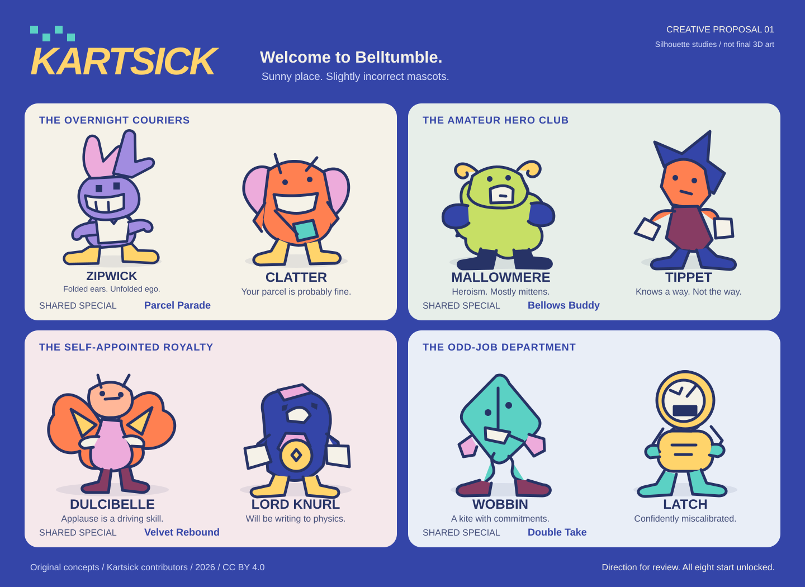

# Kartsick: welcome to Belltumble

**Creative proposal 01 - awaiting approval.**

This proposes the eight-character roster, their eight kart bodies, four shared
signature specials, six course identities, and original art/audio direction.
Names and designs are proposals, not finalized production assets or claims of
trademark clearance. The approved release scope remains unchanged.

## The direction

**A sunny place full of mascots who look slightly incorrectly manufactured.**

Belltumble is a valley of farms, shopping promenades, treetop neighborhoods, and
improbably well-maintained attractions. Its residents take a very silly racing
league completely seriously. The skyway and mountain road belong to the same
place, not six unrelated game worlds.

The visual joke is in proportions and performance: a rabbit's ears fold the
wrong way; a knightly ram has tiny horns and enormous mittens; a celebrity moth
smiles just above where her mouth ought to be. They are appealing at speed and
increasingly peculiar when the camera gets close. No gore, slime, horror teeth,
body-horror seams, or grungy parody textures.

Think enamel toys, plush fabric, translucent colored plastic, painted wood, and
rubber soles, brought together by warm lighting. Silhouettes stay smoothly
modeled; these drawings are proportion studies, not an instruction to ship flat
cutouts or stacks of primitives.

**Signature visual:** oversized tandem karts with a little rear standing deck,
so both personalities are always visible. Steering, leaning, passing an item,
and swapping become miniature physical comedy. The actual mechanics follow the
approved reference, not new comedy-driven control rules.

## Four pairs, eight personalities

| Pair | Character and silhouette | Personality and animation | Associated body |
|---|---|---|---|
| The overnight couriers | **Zipwick:** violet jackrabbit, two long folded ears of unequal length, rectangular pupils, huge flat-soled shoes, short cream delivery vest. No spikes, colored speed shoes, or familiar mascot costume. | Speaks in impatient two-note whistles. Ears point in contradictory directions while the face remains extremely confident. | **Ribbon Rocket:** narrow, swept enamel nose, fabric belt trim, exposed rear deck; responsive steering and drift, lighter contact stability. |
| The overnight couriers | **Clatter:** tangerine cicada courier, broad wing-case shoulders, pea-sized eyes above a huge straight smile, tiny sturdy legs, square satchel. Not a fox or a duplicate of Zipwick. | Always nodding half a beat too late. Wing cases buzz like a dry wooden rattle when excited. | **Parcel Pup:** rounded delivery trike-shaped body on the universal four-wheel chassis; strong acceleration/recovery, lower top speed. |
| The amateur hero club | **Mallowmere:** chartreuse fleece ram, extremely small backward-curled horns, oversized blue mittens, broad pear-shaped torso, tiny ceremonious cape. | Believes every overtake is a noble rescue. Tries to wave with both hands, remembers the steering wheel, panics briefly. | **Herd Current:** deep canoe-like shell with padded flanks and curved nose; stable cornering/contact, heavier turn-in. |
| The amateur hero club | **Tippet:** fabric trail-guide mascot, cobalt pennant-shaped hair, long apricot face, small offset eyes, oxblood romper, enormous cuffs. Neither a pointed-hat swordsman nor a workwear/plumber silhouette. | Proudly points the way after the kart has already turned. Reacts with breathy "hup" and kazoo-like nonverbal calls. | **Trail Mix:** compact trail buggy with a rolled-cloth bonnet and visible curved struts; forgiving off-road traction, reduced paved-road maximum. |
| The self-appointed royalty | **Dulcibelle:** apricot lantern moth, broad fan-shaped shoulder wings, floating-looking oval head on a short neck, tiny elbows, plum slippers. A nonhuman stage diva, not a princess in a dress. | Applauds herself. Wing fans snap open for celebrations, then close slightly out of sync. | **Gilt Trip:** low scalloped parade skiff with pearl trim; strong glide efficiency, slower ground acceleration. |
| The self-appointed royalty | **Lord Knurl:** ultramarine velvet mole, tiny cream muzzle, enormous square cuffs, a little sideways pillbox hat, and an absurdly large enamel medal. | Offended by physics. Adjusts the medal while spinning; makes pompous bassoon-like puffs. | **Velvet Hammer:** squat, wide ceremonial saloon with rounded fenders; strong contact stability and speed, wider turning radius. |
| The odd-job department | **Wobbin:** turquoise living kite/ribbon, soft diamond head, eyes printed at different heights, small mitten hands, two ribbon legs ending in heavy plum shoes. Not a star, ghost, or floating franchise creature. | Folds flat in surprise and immediately pretends nothing happened. Voice is an elastic, musical twang. | **Paperweight:** folded-looking but smoothly beveled kite shell with a low ballast pod; lively drift transitions, less planted landing behavior. |
| The odd-job department | **Latch:** marigold instrument-toy automaton, round dial face, needle eyebrows, offset rectangular grin, short accordion neck, big mint boots, tiny brass carry handle. | Measures everything incorrectly with absolute certainty. Gives three-note electronic chirps, never borrowed voice clips. | **Dial Tone:** circular instrument pod with a broad rubberized bumper and rear tool tray; balanced ground behavior, modest straight-line/glide performance. |

These are archetypal fast animal, little sidekick, earnest adventurer, glamour
mascot, pompous rival, impossible creature, and toy robot roles with their own
anatomy, wardrobe, voices, and silhouettes. There are no franchise-name jokes or
recolored near-copies.

The body descriptions are tradeoff directions, not final stat values. Every
body takes the same wheel/glider interfaces and carries two characters. All
eight are available for any valid character pairing from the start. There are
no body-exclusive handling abilities.

## Four signature specials

Shared within each default pair; mixed pairs draw from both characters' special
pools under the approved item-ownership rules. Numerical timings below are
initial tuning targets, not additional fixed product requirements. Specials
are item abilities, not always-on character perks.

| Pair / special | What happens | Warning and counterplay |
|---|---|---|
| Couriers / **Parcel Parade** | Unfolds a train of three little orange mail carts that advances along the road from the firing position for about four seconds. Its route is chosen at launch, not homing. A cart hit spins a rival once; each spent cart breaks away into harmless paper. | A postage-arrow stencil announces its lane before motion. Bounce/fire/returning projectiles can break a cart; a defensive shockwave clears nearby carts. Same-target hit immunity prevents three consecutive spins. It cannot cross gaps or attack gliders. |
| Hero club / **Bellows Buddy** | An inflatable bellows creature appears on the nose. The player can trigger two short forward gusts within a limited window. Each gives a brief thrust burst and blows away deflectable hazards/projectiles in a narrow cone. In flight it supplies forward thrust without steering the kart. | Loud inhale and an expanding striped cone precede the gust. Exposed from the rear and sides; no invincibility, no reflection of leader-seeking attacks, no extra mini-turbo generation. A nearby rival in the cone gets a small shove, not a chain-stun. |
| Royalty / **Velvet Rebound** | Three upholstered bumpers orbit close to the kart for roughly five seconds. Each can absorb one eligible projectile and return it forward as a clearly marked, nonhoming cushion shot. Spent bumpers vanish. | A countable three/two/one silhouette shows the remaining defense. Traps on the ground, bombs, leader attacks, shrinking, and theft remain counters; no broad immunity. Returned shots cannot be reflected again. A collision does not continually damage nearby karts. |
| Odd-job department / **Double Take** | Two spring-loaded cardboard doubles run on adjacent valid road lines for roughly four seconds. Eligible homing projectiles treat them as decoys; the real kart remains fully visible and vulnerable. Doubles collapse on impact and never count as racers. | Doubles are visibly hollow with striped backs, different silhouettes at close range, and a paper rattle. Straight shots, traps, blasts, and attentive aiming beat the trick. No fake lap markers, HUD changes, racer-count changes, item pickup, or blocking recovery paths. Road-only. |

Every spawn, collision, consumption, expiration, and reflected/decoy targeting
decision is authoritative. Visuals carry effect IDs and finite lifetimes so
reconciliation or migration cannot duplicate a special. A shared per-target
hit grace prevents multi-component stun locks. Explicit interaction tables will
cover every standard effect rather than relying on a catch-all "blocks items."

No special replaces manual steering/acceleration, adds a passenger rhythm
mechanic, or silently grants an unapproved permanent movement ability.

## Six stops around Belltumble

Each has a distinct route identity as well as a color scheme. This is a proposal
for the whole release, not permission to build all six before handling review.

| Course | Place and route | Set piece, risk, and shortcut |
|---|---|---|
| **Butterbell Pastures** | Late-morning farmland in butter yellow, clover green, and cornflower blue. Broad opening sweeper, barn bend, orchard switchback, windmill ridge, irrigation crossing, return through a market yard. Three laps. | Slowly swinging wind chimes above the mill advertise wind direction. A clearly marked ridge ramp opens a short glider crossing; a longer ground causeway also returns to the same ordered checkpoint corridor. A narrow barn loft saves distance but demands a clean entry. |
| **Afterglow Airway** | An elevated municipal air terminal at cobalt dusk: peach enamel platforms, magenta signal lamps, turquoise glass shelters, distant weather balloons. Three laps. | Sweeping suspended interchanges lead to a flight through an enormous departure arch. Light patterns announce moving maintenance gantries. A low, fast return lane trades recovery margin for distance; no rainbow-road imitation. |
| **Escaluna Galleria** | A lavender-and-pool-blue shopping mall with apricot awnings, a huge skylight, fictional shopfronts, and shiny but readable terrazzo. Service corridor, atrium, upper promenade, loading court. Three laps. | Escalator-shaped racing ramps climb around a kinetic shop display; crossing cleaning carts have visible stops and warning chimes. The loading-dock shortcut is short, tight, and rough, not an unvalidated cut across the atrium. |
| **Tiltglass Arcade** | A pinball pavilion built around a monumental playable table. Pearl lacquer, cherry-red rubber, navy glass, brass rails. Race on banked perimeter routes, dive through table mechanisms, climb back around a score tower. Three laps. | A rolling chrome ball passes through specific announced crossings. Lamps count down its arrival; bumpers pulse before shoving. An under-flipper service lane is a timing choice, not a slot-machine random penalty. |
| **Copperwhistle Canopy** | An autumn treetop neighborhood built like wooden wind instruments. Copper leaves, teal roofs, soft cream sky, curved branch viaducts. Three laps. | Hollow-log turns amplify the engine; a designed leaf-draft launch opens a glider link between two treehouses. Hanging seed baskets sweep predictable arcs. A narrow inner branch is quicker but offers less recovery margin. |
| **Lastlight Switchbacks** | One continuous mountain descent from a lilac summit observatory through orange rock cuttings to warm village lamps. Three scored sectors, one finish. | **Summit relay:** readable ice-edged road, not hidden slippery patches. **Switchback works:** long drifting hairpins and marked maintenance crossings. **Lastlight village:** a final glide into a wide downhill boulevard. An exposed ridge bypass trades safety for time without skipping a sector. |

Proposed cups: **Town Circuit** (Butterbell, Escaluna, Tiltglass) and
**Horizon Circuit** (Copperwhistle, Afterglow, Lastlight). The six-course tour
visits all six; every course also supports quick race, time trial, speed classes,
and mirror under the approved rules.

Environmental motion must read early enough for manual reactions. Scenic
details should never obscure the road edge, item tell, checkpoint, or another
kart. Ground and flight routes merge before shared progress validation.

## The first driving slice

After creative approval, build a polished **Butterbell Pastures study route**,
not a generic graybox labeled as the finished game. Use one fully modeled tandem
kart and the Zipwick/Clatter pair; select only the art needed for this slice.

The route should contain a generous sweeper, a tighter barn-side corner, enough
space to compare countersteering and drift release, a small contact/recovery
test area, and a designed glider ramp with a legible landing. Keep the camera's
long view open so turn-in and landing decisions come from the road.

Deliver manual keyboard and controller input, ground/air tuning, drift sparks
and a clear mini-turbo tell, surface response, sound, a readable minimal HUD, and
honest settings. No disguised auto-steering. Do not enable cup/item/online menu
buttons until those flows actually exist.

**Handling checkpoint:** the maintainer drives it with a real controller and
reviews steering weight, drift initiation/countersteer, boost timing, camera,
flight, and sense of speed. Adjust before expanding the six-course set.
Synthetic tests do not replace this feedback.

## Parts beyond bodies

All parts start unlocked. Wheel dimensions can affect handling but must not
change physics accidentally through decorative mesh collisions.

| Wheel set | Visual identity | Tradeoff direction |
|---|---|---|
| Picnic | Cream sidewalls, blue hub dots | Balanced paved-road baseline |
| Button | Small rubber tires, oversized sewn-button hub motif | Fast acceleration and tighter response; less high-speed stability |
| Thimble | Broad polished hubs, slim rubber tread | Road speed; weaker rough-surface traction |
| Bramble | Rounded knobby tread, copper hubs | Off-road grip/recovery; lower road speed |
| Cushion | Wide soft-looking tires, ribbed petal hubs | Contact and landing stability; slower turn-in |
| Spool | Tall lightweight wheel, visible colored spoke web | Sustained drift/glide efficiency; less planted ground response |

| Glider | Shape | Tradeoff direction |
|---|---|---|
| Postwing | Twin curved mail-envelope fabric panels | Balanced |
| Sunfan | Broad folding moth-fan canopy | Lift and landing forgiveness; lower flight speed |
| Crosskite | Narrow crossed spars with taut diamond sail | Speed; less forgiving stall/landing envelope |
| Bellflower | Four soft fabric lobes around a central mast | Air steering response; lower efficiency |

No hidden best build; tune combinations against measured route times, turning,
recovery, and flight behavior. Cosmetics never alter physics. Flight remains
manual and uses the actual selected canopy.

## Art system and free production

| Role | Direction |
|---|---|
| Palette | Blue hour `#3445A8`, pool `#5BD1C4`, signal tangerine `#FF8051`, custard `#FFD46B`, petal `#EDABDB`, porcelain `#F5F2E8` |
| Display | An original compact, forward-leaning Kartsick wordmark; softly squared, high-weight headings rather than a borrowed racing logo |
| Body / utility | Self-hosted Atkinson Hyperlegible, subject to recording its bundled license before use; system sans fallback. Tabular digits for timing. No runtime font-service dependency. |
| Menus | A bright physical paddock: the selected tandem kart is the centerpiece; a clear route strip leads into race setup, not a dashboard full of decorative cards |
| HUD | Large quiet numerals, readable silhouette item slots for both riders, position/lap and race timing at stable edges; no color-only state |
| Animation | Slightly delayed ears, cloth, and celebratory reactions; responsive driving animation. Reduced motion removes decorative shake/bob, not useful drift tells. |
| 3D source | Free Blender, original scripted/procedural base meshes with deliberate silhouette shaping, rigging and cleanup; retain editable source and export scripts |
| Runtime | glTF/GLB with inspected compression, compact original textures, shared materials/instances, LODs, simple separate collision meshes |
| 2D source | Original editable SVG for signs, icons, UI studies, and decals |

One visual risk is enough: the mascots' intentionally off-model proportions.
Keep road composition, race HUD, and controls disciplined. Avoid excessive
chromatic aberration, film grain, bloom, vignette, UI tilt, or eye-straining
neon that would dilute the colorful GameCube-like world.

The lineup illustration is only a quick silhouette study. Final models need
three-dimensional turnarounds, expression/pose studies, materials, consistent
scale, and readable paired seating; approval of the direction is not a claim
that this concept sheet meets the final art bar.

## Original audio

**Overall sound:** buoyant toy-synth funk, not a sound-alike soundtrack. Warm
short bass notes, brushed breakbeats, woody plucks, little brass-like synth
phrases, and deliberately lopsided call-and-response motifs.

| Scene | Sound direction |
|---|---|
| Menu / paddock | Relaxed 112 BPM pocket, elastic bass, quiet mallet hook; leave space for selection sounds and character reactions |
| Butterbell | 132 BPM, plucked strings and wooden percussion over a rounded bass groove |
| Afterglow | 144 BPM, glassy arpeggios, soft syncopated chords, distant synthetic choir |
| Escaluna | 124 BPM, deliberately earnest department-store funk with electric-piano-like tones |
| Tiltglass | 148 BPM, tight swing, mallet runs, call-and-response mechanical clacks |
| Copperwhistle | 128 BPM, breathy flute-like synthesis, brushed drums, resonant wooden accents |
| Lastlight | A 138 BPM motif that opens up harmonically between the three descent sectors; larger final section, not just faster playback |

Make original melodic material and synthesized patches locally. Use free audio
tools and reproducible synthesis/export scripts, with compact browser-compatible
exports. No paid sample libraries, voice cloning, game samples, or copied tunes.

Characters use short distinct nonverbal reactions, not constant chatter. Each
item has a recognizable attack/defense tell. Engines track load, boost has a
clear onset, drift charge is both visible and audible, and tires/landings report
surface changes without overwhelming music. Music and effects have independent
volume controls, and gameplay warnings retain visual equivalents.

## Approval boundary

Approve or revise this **creative direction** before production models, final
textures, or soundtrack composition. The full release specification is already
approved and does not need another broad interview. The driving-feel checkpoint
remains separate. No billable relay service is authorized by creative approval.
